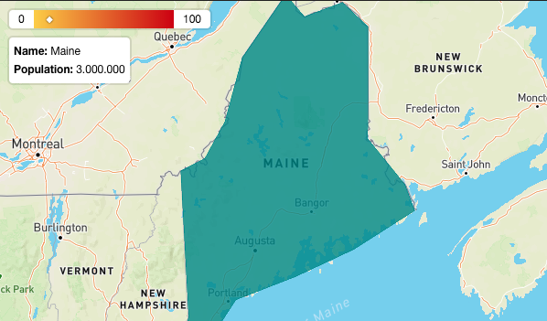

# Mapbox GL JS Style Switcher

Adds an infobox and/or gradient switch to `mapbox-gl`

## Installation:

```bash
npm i mapbox-gl-infobox --save
```

## Usage:

```ts
import { MapboxGradientBoxControl, MapboxInfoBoxControl } from "mapbox-gl-infobox";
import { Map as MapboxMap } from "mapbox-gl";

import "mapbox-gl-infobox/styles.css";

const map = new MapboxMap();
map.addControl(new MapboxGradientBoxControl());
map.addControl(new MapboxInfoBoxControl());
```

## Options:
You can also supply your own options.

```ts
const layerId = "features";
const minMaxValues = {minValue: 0, maxValue: 100};
const weightGetter = properties => properties ? properties['weight'] : 0;
map.addControl(
    new MapboxGradientBoxControl(
        layerId, 
        minMaxValues, 
        weightGetter
    )
);

const formatter = properties => properties ? `<b>Name:</b> ${properties['name']}` : '';
map.addControl(
    new MapboxInfoBoxControl(
        layerId,
        formatter
    )
);
```

## Screenshots

